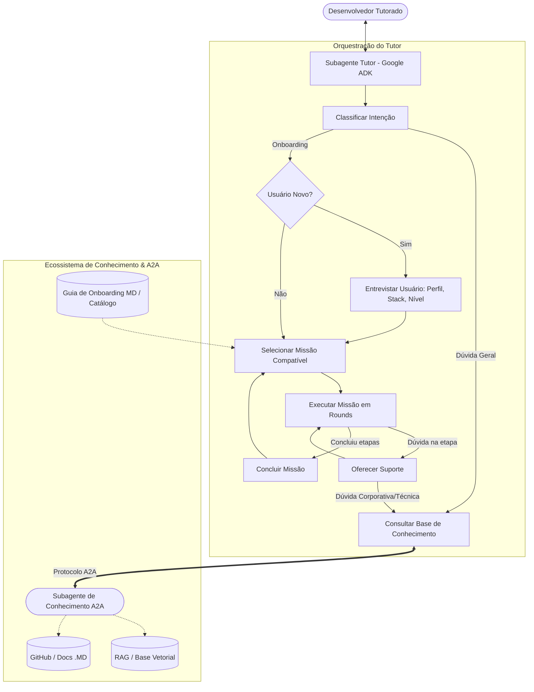

# 🎓 Agente Tutor de Onboarding (Google ADK)

Agente inteligente de mentoria técnica e de negócio para onboarding de novos desenvolvedores de software, desenvolvido sobre o **Google ADK (Agent Development Kit)** com suporte ao protocolo **A2A (Agent-to-Agent)**.

---

## 📌 1. Visão Geral

O **Agente Tutor** orienta o desenvolvedor ao longo de sua jornada inicial através de **missões guiadas interativas**:
- **Missões de Negócio**: Permitem compreender o domínio corporativo e fluxos de sistemas em ambiente de homologação (ex: criação de documentos, fluxo de aprovação, conformidade e KYC).
- **Missões Técnicas**: Conduzem a exploração arquitetural dos microsserviços nos repositórios GitHub, descoberta de tecnologias, motores de armazenamento (PostgreSQL, MinIO/S3), mensageria (Kafka) e testes locais.
- **Ciclo em Rounds**: A cada iteração dentro de uma missão, o desenvolvedor pode avançar na etapa prática ou tirar dúvidas técnicas/processuais.
- **Comunicação A2A com Subagente de Conhecimento**: Dúvidas corporativas e arquiteturais profundas são consultadas diretamente em um **Subagente de Conhecimento via protocolo A2A**.

---

## 🏗️ 2. Arquitetura do Sistema



---

## 📂 3. Estrutura do Repositório

```text
agente-tutor/
├── pyproject.toml              # Metadados e dependências do projeto
├── requirements.txt            # Dependências prontas para pip install
├── .env.example                # Exemplo de variáveis de ambiente
├── .gitignore                  # Arquivos ignorados pelo Git
├── README.md                   # Documentação detalhada
├── agent.py                    # Entrypoint nativo para ADK CLI (adk run . / adk web .)
├── main.py                     # CLI interativo e runner de demonstração
│
├── config/
│   ├── __init__.py
│   └── settings.py             # Configurações Pydantic (Modelos, URLs A2A, portas)
│
├── data/
│   └── missions/               # Guia e catálogo de missões
│       ├── business_missions.json   # Missões de negócio (ex: criar documento em homologação)
│       ├── technical_missions.json  # Missões técnicas (ex: investigar microsserviço de documento)
│       └── guia_onboarding.md       # Guia oficial de onboarding em Markdown
│
├── src/
│   ├── __init__.py
│   ├── tutor_agent.py          # Definição e configuração do Agent no Google ADK
│   ├── prompts.py              # Prompt base e regras pedagógicas do tutor
│   ├── models/
│   │   ├── __init__.py
│   │   ├── profile.py          # Schema de Perfil do Dev (backend/frontend, stack, nível)
│   │   ├── mission.py          # Schemas de Missão, Etapas (Steps) e Status
│   │   └── state.py            # Estrutura do Estado mantido na sessão
│   ├── services/
│   │   ├── __init__.py
│   │   ├── mission_service.py  # Serviço de carga e filtragem de missões
│   │   └── knowledge_client.py # Cliente A2A com fallback resiliente para mock local
│   ├── tools/
│   │   ├── __init__.py
│   │   ├── profile_tools.py    # Ferramentas: register_developer_profile, get_developer_profile
│   │   ├── mission_tools.py    # Ferramentas: list, start, get_status, advance, complete
│   │   └── knowledge_tools.py  # Ferramenta: ask_knowledge_agent (invoca A2A)
│   └── mock_kb/
│       ├── __init__.py
│       └── mock_kb_server.py   # Servidor A2A simulador para testes locais
│
└── tests/
    ├── __init__.py
    ├── test_models.py          # Testes unitários de modelos e validações
    ├── test_mission_service.py # Testes de filtragem e catálogo de missões
    ├── test_tools.py           # Testes das ferramentas com injeção de estado
    └── test_knowledge_a2a.py   # Teste do protocolo A2A e cliente de conhecimento
```

---

## 🚀 4. Como Executar

### 4.1. Instalação do Ambiente

Certifique-se de ter o Python 3.10+ instalado:

```bash
# Criar ambiente virtual
python -m venv .venv

# Ativar o ambiente virtual:
# Windows (PowerShell):
.venv\Scripts\Activate.ps1
# Linux/macOS:
source .venv/bin/activate

# Instalar dependências
pip install -r requirements.txt
```

### 4.2. Configuração de Variáveis de Ambiente

Copie o arquivo `.env.example` para `.env` e configure conforme necessário:

```bash
cp .env.example .env
```

Parâmetros principais:
- `GOOGLE_GENAI_API_KEY`: Sua chave de API do Gemini (Google AI Studio).
- `TUTOR_MODEL`: Modelo do Gemini utilizado (padrão: `gemini-2.5-flash`).
- `KNOWLEDGE_AGENT_CARD_URL`: URL onde o Agent Card do subagente de conhecimento responde via A2A (padrão: `http://localhost:8001/.well-known/agent-card.json`).
- `KNOWLEDGE_AGENT_MOCK_FALLBACK`: Quando `true`, permite que o tutor responda com dados de contingência locais se o servidor de conhecimento estiver offline.

---

## 🎮 5. Modos de Execução

### Opção 1: Demonstração do Fluxo Completo (Recomendado)
Executa a jornada completa do fluxograma de forma guiada no terminal (entrevista, recomendação de missões, avanço passo a passo, consulta A2A e conclusão):

```bash
python main.py --demo
```

### Opção 2: CLI Nativa do Google ADK
O projeto possui o `agent.py` na raiz expondo `root_agent`, permitindo uso direto das ferramentas do Google ADK:

```bash
# Executar no terminal interativo do ADK
adk run .

# Iniciar servidor Web com UI do ADK
adk web .
```

### Opção 3: Iniciar o Mock Knowledge Agent (A2A)
Para testar a integração A2A em tempo real em duas portas separadas:

```bash
# Terminal 1: Iniciar o servidor da Base de Conhecimento A2A (porta 8001)
python main.py --mock-kb

# Terminal 2: Executar o Tutor (que se comunicará via HTTP JSON-RPC com a porta 8001)
python main.py --demo
```

### Opção 4: Executar Testes Automatizados

```bash
pytest tests/ -v
# ou via main:
python main.py --test
```

---

## 🔄 6. Ciclo de Vida de uma Missão em Rounds

Conforme especificado na arquitetura:
1. **Início**: O dev escolhe uma missão compatível com seu perfil (ex: `tech-01`).
2. **Apresentação do Passo**: O tutor exibe o título da etapa, instrução detalhada, ação esperada e dicas.
3. **Iteração (Round)**:
   - **Caso o dev tenha dúvida**: O dev faz perguntas (ex: *"qual o motor de banco deste microsserviço?"*). O tutor consulta a Base de Conhecimento via A2A (`ask_knowledge_agent`), esclarece e **relembra o dev do objetivo da etapa**.
   - **Caso o dev execute o passo**: O dev informa a conclusão ou resultado obtido. O tutor valida os critérios e chama `advance_mission_step`.
4. **Finalização**: Quando todas as etapas são concluídas, a missão é salva na lista de concluídas e o tutor parabeniza o desenvolvedor, abrindo espaço para novas missões.

---

## 🔌 7. Como Evoluir o Agente de Conhecimento (A2A)

A integração foi desenvolvida seguindo o padrão **Agent2Agent (A2A)** do Google:
1. O subagente de conhecimento (desenvolvido à parte com RAG, base vetorial e repositórios GitHub) deve expor seu **Agent Card** no endpoint:
   `GET /.well-known/agent-card.json`
2. O endpoint de mensagens deve aceitar requisições JSON-RPC 2.0:
   `POST /message` com payload `{"jsonrpc": "2.0", "method": "message", "params": {"content": "...", "context": "..."}, "id": 1}`.
3. Para conectar o tutor ao seu agente real, basta alterar no `.env`:
   ```env
   KNOWLEDGE_AGENT_CARD_URL=http://seu-servidor-conhecimento:porta/.well-known/agent-card.json
   KNOWLEDGE_AGENT_MOCK_FALLBACK=false
   ```

---

## 📝 8. Como Adicionar Novas Missões

Para adicionar novas missões, basta editar os arquivos JSON em `data/missions/`:
- `business_missions.json` para tarefas de negócio.
- `technical_missions.json` para tarefas técnicas.

Cada missão aceita filtros de compatibilidade (`target_area`: `backend` | `frontend` | `all`, `compatible_stacks`: `["java", "python", "angular", "all"]`, `min_experience_level`: `junior` | `pleno` | `senior`), garantindo que o tutor recomende sempre as missões certas para cada perfil de desenvolvedor!
